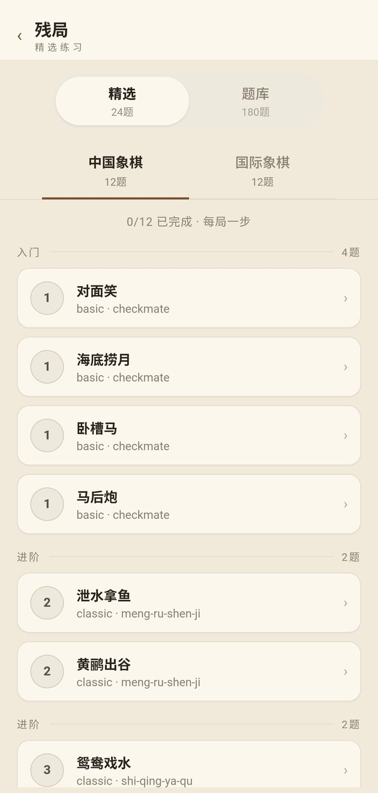
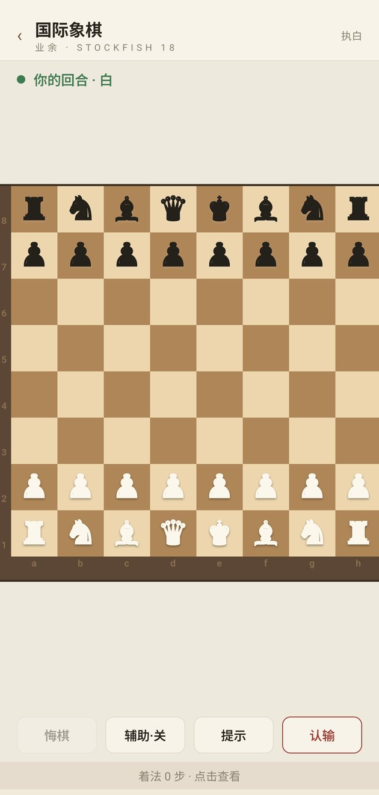
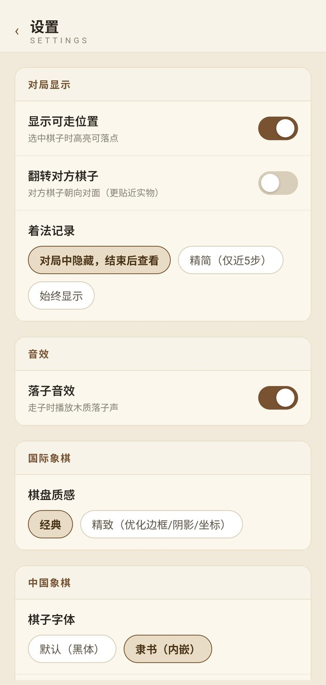

# 棋弈 ChessLab

> 单机双棋种对弈 · 国际象棋 + 中国象棋 · 离线满血引擎 · 残局训练

<div align="center"></div>

**棋弈**是一款完全离线的单机对弈应用，内置两套顶级 UCI 引擎：国际象棋 **Stockfish 18**、中国象棋 **Pikafish 2026-01-02（皮卡鱼）**。无联网、无广告、无内购，安装即玩，本体以 **MIT** 开源发行（引擎为 GPLv3 独立进程聚合分发）。支持**人机对弈、同机双人、双机观战、残局训练**四种玩法，适配 **Windows** 与 **Android**。

---

## 目录

- [棋弈 ChessLab](#棋弈-chesslab)
  - [目录](#目录)
  - [下载安装](#下载安装)
    - [Windows](#windows)
    - [Android](#android)
    - [从源码构建](#从源码构建)
  - [玩法总览](#玩法总览)
    - [难度体系](#难度体系)
    - [对局控制](#对局控制)
  - [对弈功能](#对弈功能)
  - [规则与局限](#规则与局限)
    - [已实现](#已实现)
    - [局限与后续（](#局限与后续)
  - [残局训练](#残局训练)
    - [精选 · 24 局（循序渐进）](#精选--24-局循序渐进)
    - [题库 · 180 局（自主选练）](#题库--180-局自主选练)
    - [训练交互](#训练交互)
  - [棋盘与视觉](#棋盘与视觉)
    - [国际象棋](#国际象棋)
    - [中国象棋](#中国象棋)
    - [通用](#通用)
  - [设置项](#设置项)
  - [引擎与离线](#引擎与离线)
  - [使用技巧](#使用技巧)
  - [面向开发者](#面向开发者)
    - [技术栈](#技术栈)
    - [架构分层](#架构分层)
    - [常用命令](#常用命令)
    - [Android 构建要点](#android-构建要点)
  - [目录结构](#目录结构)
  - [许可证与致谢](#许可证与致谢)
  - [文档索引](#文档索引)

---

## 下载安装

### Windows

| 项目   | 说明                                                                                             |
| ------ | ------------------------------------------------------------------------------------------------ |
| 安装包 | `dist/ChessLab-<版本>-windows-x64-setup.exe`（NSIS，约 127 MB，含双引擎）                        |
| 便携版 | `dist/ChessLab-<版本>-windows-x64-portable.zip`（解压即用，`ChessLab.exe` 与 `engines/` 同目录） |
| 签名   | 未使用商业证书，首次运行提示"未知发布者"时选择 **仍要运行**                                      |

### Android

| 项目   | 说明                                                                              |
| ------ | --------------------------------------------------------------------------------- |
| 安装包 | `dist/ChessLab-<版本>-android-universal.apk`（universal 全架构，约 137 MB）       |
| 签名   | 自签名证书 `gen/android/chesslab.jks`（alias `chesslab`），apksigner v2/v3 已校验 |
| 安装   | 允许"安装未知来源应用"后直接安装                                                  |

> 体积说明：引擎占大头（Stockfish 约 114 MB + Pikafish NNUE 约 53 MB），属正常现象。AAB 位于 `bundle/universalRelease/`。

### 从源码构建

```powershell
pnpm install
pnpm build              # Windows NSIS + Android APK/AAB 一键构建
pnpm build:windows      # 仅 Windows
pnpm build:android      # 仅 Android（需 ANDROID_HOME / NDK）
```

产物统一输出到仓库根目录 `dist/`，由 `build.js` 负责命名、签名（Android apksigner）与便携包压缩。

---

## 玩法总览

| 模式     | 说明                                                                                      |
| -------- | ----------------------------------------------------------------------------------------- |
| **人机** | 选择执子颜色（象棋红先/国象白先）与难度，与引擎对弈                                       |
| **双人** | 同机双人轮流落子，不启动引擎                                                              |
| **观战** | 双机对弈：分别设置红/白与黑方棋力；`自动` 按延迟走子，`手动步进` 每点一次"下一步"进一步   |
| **残局** | 精选 24 局 + 题库 180 局，以残局局面与 AI 完整对弈（可选难度），详见[残局训练](#残局训练) |

### 难度体系

五档难度对应引擎强度 1–20 级：

| 档位 | 入门 | 业余 | 进阶 | 大师 | 特级 |
| ---- | ---- | ---- | ---- | ---- | ---- |
| 强度 | 2    | 6    | 10   | 14   | 18   |

- **Stockfish**：原生 `UCI_LimitStrength + UCI_Elo`（1320–3190 线性映射），跨设备棋力一致。
- **Pikafish**：2026-01-02 版无 `UCI_Elo / Skill Level`，采用宿主弱化——`nodes + depth` 主限（硬件无关，同一节点数同一着法）+ `movetime` 安全帽 + **近分随机**：仅当多路着法分差落在模糊窗口内（分差不悬殊、不致命，且不会送杀/被杀）时随机选择，否则必走最优着，杜绝"故意走错"的僵硬感，棋力随搜索预算递增。

### 对局控制

- **悔棋**：人机模式一次撤回一个回合（对方应着 + 己方着法）；观战模式撤至上一回合。
- **认输 / 提示 / 辅助分析**：对局页底部直接操作。
- **暂停 / 继续**：仅观战自动模式可见；引擎思考时"下一步"自动禁用。
- **音效**：落子声（可关闭），走子即响。
- **切后台**：自动挂起引擎搜索、暂停时钟与辅助分析，回前台恢复（功耗友好）。

---

## 对弈功能

- **合法落点**：选中己方棋子后高亮全部可落点（设置中可关闭）。
- **上一步高亮**：起点淡黄、落点深黄 + 环形描边，观战讲解更清晰。
- **提示**：高亮引擎推荐着法（蓝色，起讫同显），点击落点直接走此着。
- **辅助分析**：开启后常驻顶部，显示 `MultiPV` 前 3 变着与分数；观战模式自动开启、更新不抖动；关闭或对局结束后自动隐藏（不显示"计算中"占位）。
- **着法记录**：默认"对局中隐藏，结束后查看"；结束后可在结果卡或棋盘底部独立弹窗查看完整记录，避免挤占棋盘。
- **中国象棋记谱**：`坐标（h2e2）` / `传统（炮二平五、兵五进一）` 可切换；传统记谱自动处理同列多子 `前/后/中` 与 `进/退/平`。
- **胜负判定**：完整规则——将死、困毙（象棋无子可动判负，国象逼和判和）、三次重复、五十回合/自然限着、子力不足；中国象棋三次重复触发**长将判负**（单方连续将军两循环不改着则判负，双方均长将按和棋处理，详见[规则与局限](#规则与局限)）；结果卡显示胜负方（象棋"红方胜"、国象"白方胜"）与原因。
- **翻转对方棋子**：对方棋子 180° 朝向对面，贴近实物棋盘体验。

<div align="center"></div>

---

## 规则与局限

本节说明当前版本（0.3.2）已实现的终局判定与已知局限，便于评测与后续迭代。

### 已实现

| 棋种         | 终局类型                              | 行为                                                                                                                                               |
| ------------ | ------------------------------------- | -------------------------------------------------------------------------------------------------------------------------------------------------- |
| **通用**     | 将死 / 将杀                           | 正常判胜负                                                                                                                                         |
| **中国象棋** | 困毙                                  | 无合法着法且未被将军 → 困毙方判负（区别于国象逼和）                                                                                                |
| **中国象棋** | 长将（单方）                          | 同一局面第三次出现时，回溯两循环：**仅一方着着将军、另一方非全将军 → 将军方判负**（`perpetual-check`），直接解决“守方长将导致残局和棋无法解开”问题 |
| **中国象棋** | 三次重复（其他）                      | 非单方长将的第三次重复判和（`repetition`）                                                                                                         |
| **中国象棋** | 自然限着                              | 120 半回合（60 回合）无吃子判和（`agreement`）                                                                                                     |
| **中国象棋** | 子力不足                              | 仅剩双王或无车马炮兵判和                                                                                                                           |
| **国际象棋** | 三次重复 / 五十回合 / 子力不足 / 逼和 | 委托 `chess.js` 标准实现                                                                                                                           |

**引擎侧配套（已落地，不可见但影响对局质量）：**

- 对局与提示/辅助分析向引擎发送**完整着法历史**（`position fen <初始> moves <全程>`），引擎不再“重复盲”，可正确评估重复与长将惩罚；Pikafish 内置亚洲规则长将评分亦能生效。
- 皮卡鱼低难度“近分随机”增加**防重复护栏**：候选着若会造成局面第二次出现（`occurrencesAfter ≥2`）则不进入随机池，杜绝随机化把引擎本不想走的重复硬拉进对局；引擎最优着本身不受护栏限制，是否长将由客户端裁决器最终判定。

### 局限与后续（

| 局限                 | 说明                                                                                                                                 | 影响                                 | 计划                                                 |
| -------------------- | ------------------------------------------------------------------------------------------------------------------------------------ | ------------------------------------ | ---------------------------------------------------- |
| 长捉完整分类未实现   | 长捉（`perpetual-chase`）涉及捉/兑/献、牵制、保护、过河兵例外等数十条例外，当前版本**一律按和棋**处理                                | 极少数追逐局面会判和而非长捉方判负   | 引入简化版长捉识别（同子连捉无保护大子），再逐步补全 |
| 双方均禁（双长将等） | 双方两循环均为禁止着法时，当前按**和棋**处理，未细分“先提议变着”或双负等罕见组合                                                     | 几乎不影响常规对局与题库             | 文档化口径，后续按《象棋竞赛规则》细化               |
| 长将判定严格两循环   | 需连续两循环“着着将军”才判负，中途夹一步非将军即不判负（符合规则），但不同路径回到同局面的“异形循环”按并集窗口判定，偏保守、不会误判 | 无误判风险，极端异形循环可能少判一次 | 保持                                                 |
| 国际象棋重复依赖上游 | 国象重复/五十回合直接沿用 `chess.js`，未额外做长将类特殊裁决（国象无需）                                                             | 无                                   | 保持                                                 |

> 设计取舍：**长将零误判优先**（将军检测为精确的 `isCheck()` 回放，非启发式），**长捉宁和不误**。残局题库 204 局中，因守方长将被判和而“无法解开”的问题已在 0.3.2 中解决。

---

## 残局训练

首页"残局"入口进入，分**精选**与**题库**两区，共 **204 局**，全部经规则库校验（FEN 合法、非终局、执先方均有合法着法，204/204 校验通过；平均合法着 29.3、161 局 ≥20 着），离线可用。

### 精选 · 24 局（循序渐进）

按难度 1–5 级分组，每局以残局局面与 AI 完整对弈，可选对手难度（入门–特级，对应引擎强度 2/6/10/14/18），适合复杂残局深度对抗：

| 棋种     | 数量 | 内容                                                                                                                      |
| -------- | ---- | ------------------------------------------------------------------------------------------------------------------------- |
| 中国象棋 | 12   | 基本杀法（对面笑 / 海底捞月 / 卧槽马 / 马后炮）→《梦入神机》→《适情雅趣》→ 江湖四大名局（蚯蚓降龙 / 千里独行 / 野马操田） |
| 国际象棋 | 12   | 理论必修定式（Lucena 搭桥 / Philidor 第三横线 / Vancura / Réti）+ Lichess 高分实战残局（Popularity ≥ 90）                 |

### 题库 · 180 局（自主选练）

| 棋种     | 数量 | 来源与筛选                                                                                          |
| -------- | ---- | --------------------------------------------------------------------------------------------------- |
| 中国象棋 | 100  | 《适情雅趣》50 + 江湖残局 20 + 基本杀法 15 +《梦入神机》15，全部经 `rules-xiangqi` 合法性与杀着校验 |
| 国际象棋 | 80   | Lichess Puzzle DB（600 万局，CC0）按 `endgame` 主题 + `Popularity ≥ 85` + Rating 1200–2300 精筛     |

题库支持：**关键词搜索**（标题 / 主题 / ID）、**难度筛选**（1–5 级胶囊）、**随机抽题**、**分页加载**（每次 24 局）。

<div align="center"></div>

### 训练交互

- **人机对战**：以残局 FEN 为起点，执先方与引擎完整对弈至终局（将死/困毙/和棋等，同正式对局规则）；胜利方为执先方时自动记为已完成，负/和可重开再战。复杂局面（平均 29 着、161 局 ≥20 着）不再做单步强制判定。
- **可选难度**：每局内置难度选择器（入门 2 / 业余 6 / 进阶 10 / 大师 14 / 特级 18），切换即重开；低难度适合练手，高难度需精确防守/进攻。
- **提示 / 悔棋 / 认输 / 重开**：与正常人机对局一致；提示与辅助分析沿用引擎最强着，不依赖预存解法。
- **连续闯关**：底部"上一题 / 下一题"切换；胜利自动打 ✓ 并持久化，列表实时同步。
- **数据格式**：统一 `Puzzle` 结构（`fen / sideToMove / themes / rating / source / license`，预存 `solution` 仅作参考），位于 `packages/puzzles`，FEN 均已校验适合作为人机残局起点。

---

## 棋盘与视觉

### 国际象棋
<div align="center"></div>

- **经典 / 精致** 两档：精致档为胡桃木斜向渐变边框、内阴影、淡金坐标、棋子微立体阴影与字形渲染优化。
- 字形棋子（Unicode 实心字形），跨平台渲染一致。

### 中国象棋
<div align="center"></div>

- **平板 / 仿真** 两档：仿真为细腻木纹底 + 棋子结构化立体（顶部高光、边缘厚度、投影）；棋盘本体保持平板不做渐变。
- 墨线棋盘：河界"楚河 漢界"典雅衬线、九宫斜线、双线边框，棋子落于交叉点。
- **棋子字体**：默认 `Noto Sans SC / 黑体`；隶书为内嵌 `ChessLishu.woff2`（LiSu 子集仅 18 字，笔画放大 0.62×），无需联网。

### 通用

- 全应用隐藏原生滚动条（`scrollbar-width: none`），保留触控 / 滚轮滚动。
- 窗口 `480×860`（最小 360×600），棋盘随窗口自适应缩放。
- 双主题 CSS 变量体系（`theme-chess` / `theme-xiangqi`），组件零硬编码色值。

---

## 设置项

<div align="center"></div>

首页"设置"进入，分四组，全部自动持久化（`localStorage: chesslab.settings.v1`）：

| 分组         | 设置                                                                          |
| ------------ | ----------------------------------------------------------------------------- |
| **对局显示** | 显示可走位置 · 翻转对方棋子 · 着法记录模式（隐藏/紧凑/常驻）· 落子音效        |
| **国际象棋** | 棋盘质感（经典 / 精致）                                                       |
| **中国象棋** | 棋子字体（黑体 / 隶书）· 棋盘棋子质感（平板 / 仿真）· 记谱方式（坐标 / 传统） |
| **观战**     | 自动步进延迟（无 / 0.5 / 0.8 / 1.2 / 2 秒）                                   |

残局进度独立存储（`chesslab.puzzles.progress.v1`），可在残局页"重置进度"。

---

## 引擎与离线

- **双引擎随包分发**：Stockfish 18（国象）与 Pikafish 2026-01-02（象棋）以独立进程 + UCI 文本协议（stdio）运行，通过 Tauri `spawn` + 流式 `stdout` 桥接，全程无需联网。
- **Pikafish NNUE**：`pikafish.nnue` 随包分发，`EvalFile` 自动指向——Windows 为 `resources/engines`，Android 为 `jniLibs/arm64-v8a/libpikafish_nnue.so`（`nativeLibraryDir` 方案，兼容 Android 10+ W^X 策略）。
- **引擎生命周期**：每局最多三个实例——对手（1）+ 辅助分析（1，常驻复用）+ 提示（1，懒加载复用）；离开对局页全部回收，退出即杀进程。
- **握手健壮性**：进程意外退出时立即失败并给出友好提示（"引擎启动超时 / 进程异常退出"），不产生未处理异常。
- **诊断页**：一键检测 `spawn → uci 握手 → 选项 → NNUE → 搜索`，展示引擎名、选项数与测试着法耗时。

---

## 使用技巧

- 象棋点击己子出现圆点即为合法落点；再点目标点走子，点同一子取消。
- 提示高亮为蓝色、起讫同显；此时直接点落点即走提示着。
- 象棋红先黑后、国象白先黑后，在对应棋种配置页选择执子。
- 观战时可随时"暂停 / 继续"，配合延迟设置适合讲解与演示。
- 残局卡壳时先点"提示"看起点，再自己想落点，最后才用"解答"。
- 悔棋在人机模式会连对方应着一起撤回，放心使用。

---

## 面向开发者

### 技术栈

| 层       | 选型                                                                                  |
| -------- | ------------------------------------------------------------------------------------- |
| 客户端   | Tauri 2 + React 18 + Vite 5 + TypeScript（`apps/desktop`），WebView2 / System WebView |
| 移动端   | Tauri 2 Android（Rust 交叉编译 + Gradle），`gen/android` 工程                         |
| 规则内核 | 纯 TS：chess.js（BSD-2）+ vendor xiangqi.js（BSD-2，含长将裁决扩展 `adjudicate.ts`）  |
| 引擎协议 | UCI 驱动：解析 / 串行队列 / 握手 / 强度映射 / MultiPV 弱化 + 防重复护栏               |
| 测试     | Vitest，11 个套件 94 用例（`pnpm test`）                                              |

### 架构分层

```
UI (src-ui)            screens / components / theme（CSS 变量双主题）
  │ SessionEvent 流
GameSession (packages/game-session)   状态机 · 时钟 · 辅助分析 · suspend/resume · 完整历史透传 + 随机防重复
  │ EngineTurnRunner / AssistEngine (moves 历史 + guardCandidate)
engine-uci             协议解析 · UciEngineDriver · 强度策略（Elo / Pikafish 宿主弱化 + 近分随机护栏）
  │ EngineTransport ←—— 关键抽象缝
transport/tauri.ts     invoke + listen(engine://line/<id>)
engines.rs             Rust 进程管理：spawn / write / stop / stdout 流式事件
rules-core             RulesAdapter 统一抽象（Side 归一化 w/b · UCI 坐标着法 · occurrencesAfter?）
rules-xiangqi          xiangqi.js 封装 + 长将裁决（adjudicate.ts，三次重复两循环回放判定）
puzzles                残局数据包：Puzzle 统一结构 · 204 局 · 合法性校验
persistence            GameRepository 接口（memory / node-file，可换 SQLite）
```

分层原则：**纯逻辑包零 React 依赖**（Node 下可测）；**传输即插件**（新平台只增一个 Transport 实现）；**残局即数据**（`Puzzle` 结构与引擎 / 规则层解耦）。

### 常用命令

```powershell
pnpm install
pnpm typecheck              # tsc -b 全仓类型检查
pnpm test                   # vitest 全部单测
pnpm test:watch
pnpm --filter desktop dev   # 前端 1420 + Rust 增量编译
pnpm --filter desktop build # 前端生产构建（tsc --noEmit + vite build）
pnpm build                  # 一键出 Windows + Android 产物到 dist/
pnpm fetch:engines          # 下载官方引擎二进制到 third_party/
pnpm sync:jniLibs           # 同步 Android jniLibs（libstockfish/libpikafish/nnue）
pnpm smoke:engines          # Node 侧真实引擎冒烟（握手→搜索）
```

### Android 构建要点

- 需要 `ANDROID_HOME` 与 NDK（Rust 交叉编译）；JDK 21（Temurin）。
- `build.js` 在构建前自动同步 jniLibs（引擎 so + NNUE），产物自动 apksigner 签名并输出到 `dist/`。

---

## 目录结构

```
chesslab/
├── apps/
│   ├── desktop/               # Tauri 2 主应用（Windows + Android）
│   │   ├── src-ui/            # 前端：screens / components / state / theme / transport
│   │   ├── src-tauri/         # Rust：engines.rs 进程桥 · tauri.conf.json · gen/android
│   │   └── engines/           # 开发期引擎二进制（打包为 resources）
│   └── chessapp/              # 早期 React Native 版本（冻结存档，仅供参考）
├── packages/
│   ├── rules-core/            # RulesAdapter / Side / MoveUci / GameResult 统一抽象
│   ├── rules-chess/           # chess.js 封装（null-returning 适配）
│   ├── rules-xiangqi/         # vendor xiangqi.js 封装（r/w 转译）
│   ├── engine-uci/            # UCI 协议 / 驱动 / 引擎档案 / 强度策略
│   ├── engine-process/        # 传输抽象（接口保留）
│   ├── game-session/          # 对局状态机 / 时钟 / 辅助分析
│   ├── persistence/           # 对局存储接口 + memory/node-file 实现
│   └── puzzles/               # 残局数据包：types + data（精选 24 + 题库 180）+ 校验
├── scripts/                   # 引擎获取 / 冒烟 / 截图 / 构建辅助
├── third_party/               # 官方引擎二进制（fetch:engines 下载）
├── build.js                   # 一键构建：Windows NSIS/便携 + Android APK/AAB → dist/
└── dist/                      # 构建产物输出
```

---

## 许可证与致谢

**本项目（ChessLab 本体）以 [MIT](./LICENSE) 许可发行**，可自由使用、修改、商用（保留版权声明即可）。第三方组件各自保留其原始许可证，随分发附带（见 [`licenses/`](./licenses/README.md)）：

| 组件                             | 许可证        | 说明                                                                                                                                                          |
| -------------------------------- | ------------- | ------------------------------------------------------------------------------------------------------------------------------------------------------------- |
| **ChessLab 本体**                | **MIT**       | 应用全部源码（`apps/`、`packages/`、`scripts/`、`docs/`）                                                                                                     |
| Stockfish                        | GPL-3.0       | 独立进程 + 未修改官方二进制（聚合分发，附许可证文本与源码链接）                                                                                               |
| Pikafish                         | GPL-3.0       | 同上，NNUE 权重随包                                                                                                                                           |
| chess.js                         | BSD-2         | 国际象棋规则内核                                                                                                                                              |
| xiangqi.js (vendored)            | BSD-2         | 中国象棋规则内核，`vendor/` 保留原 LICENSE                                                                                                                    |
| 残局题库（象棋）                 | MIT           | 来自 [dffge552/xiangqi-pwa-offline](https://github.com/dffge552/xiangqi-pwa-offline)（适情雅趣 / 梦入神机 / 基本杀法 / 江湖残局），数据 `source` 字段逐条署名 |
| 残局题库（国象）                 | CC0           | [Lichess Puzzle Database](https://database.lichess.org/)（按主题与口碑精筛）                                                                                  |
| 古典定式（Lucena / Philidor 等） | Public Domain | 数百年公有领域理论局面                                                                                                                                        |

> 合规边界：MIT 仅覆盖本项目自有代码；Stockfish / Pikafish 以**独立进程 + 未修改官方二进制**方式交互，构成聚合（aggregate）而非衍生，GPL 仅约束引擎自身、不传染 MIT 应用代码。分发时附带 `licenses/GPL-3.0.txt` 与官方源码链接即满足其义务。

---

## 文档索引

| 文档                         | 内容                                                    |
| ---------------------------- | ------------------------------------------------------- |
| `docs/02-tauri-migration.md` | RN → Tauri 2 迁移决策与规划（**当前权威**）             |
| `docs/01-tech-selection.md`  | 早期技术选型记录（历史存档）                            |
| `docs/puzzles/README.md`     | 残局题库调研：来源评估 / 筛选策略 / 格式定义 / 校验流程 |
