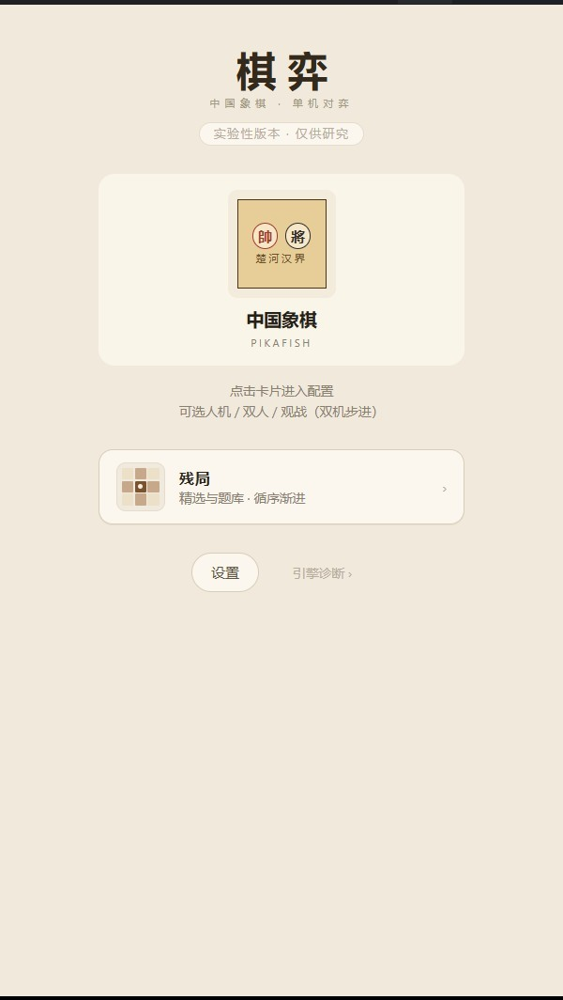
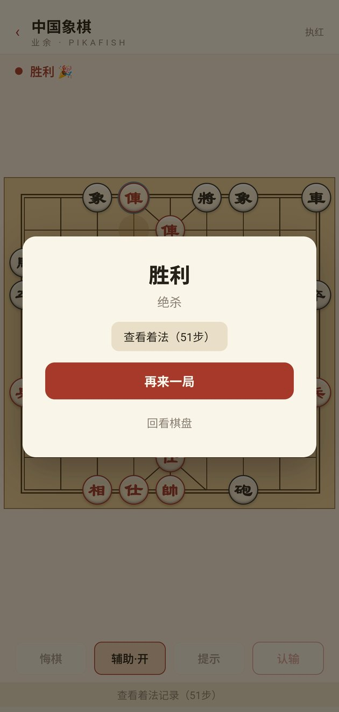
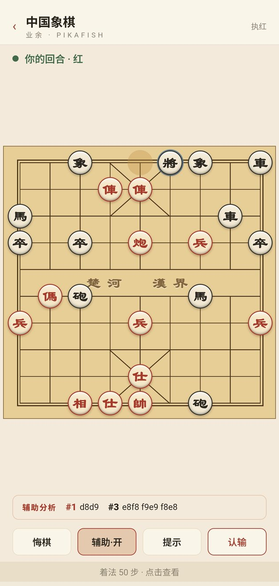

# ChessNext · 中国象棋（实验性研究版）

> **实验性版本 `0.4.0-alpha`** · 单一棋种：中国象棋 · 离线引擎 · **三套棋力方案** · 残局训练

<div align="center"></div>

> ⚠️ **这是一个实验性 / 研究性分支**，在 [ChessLab](https://github.com/iYeXin/ChessLab) 基础上做了激进裁剪、缺陷修复与三项新实验。版本号 `0.4.0-alpha` 表示接口与行为仍可能变动，请勿用于正式发行。

**ChessNext** 是一款完全离线的单机中国象棋应用，内置 UCI 引擎 **Pikafish 2023-03-05（皮卡鱼）**。无联网、无广告、无内购，安装即玩，本体以 **MIT** 开源发行（引擎为 GPLv3 独立进程聚合分发）。支持**人机对弈、同机双人、双机观战、残局训练**四种玩法，适配 **Windows** 与 **Android**。

---

## 目录

- [ChessNext · 中国象棋（实验性研究版）](#chessnext--中国象棋实验性研究版)
  - [棋力方案：三种模式](#棋力方案三种模式)
    - [测试人员模式](#测试人员模式)
  - [从源码构建](#从源码构建)
  - [玩法总览](#玩法总览)
  - [对弈功能](#对弈功能)
  - [规则与局限](#规则与局限)
  - [残局训练](#残局训练)
  - [棋盘与视觉](#棋盘与视觉)
  - [设置项](#设置项)
  - [引擎与离线](#引擎与离线)
  - [模式 3 的边界（不要宣称什么）](#模式-3-的边界不要宣称什么)
  - [与上游 ChessLab 的差异](#与上游-chesslab-的差异)
  - [面向开发者](#面向开发者)
  - [目录结构](#目录结构)
  - [许可证与致谢](#许可证与致谢)
  - [文档索引](#文档索引)

---

## 棋力方案：三种模式

**默认模式 1。** 三个模式的选择入口在「选择难度」的模态框里（需先开启**测试人员模式**）。

| 模式 | 名称 | 做法 | 额外资源 |
| ---- | ---- | ---- | -------- |
| **1** | 搜索预算弱化（默认） | `nodes` + `depth` 主限 + `movetime` 安全帽，**仅在同分着法间随机**（近分随机 + 防重复护栏） | 无 |
| **2** | 引擎原生棋力选项 | 直接用引擎自己的 `UCI_Elo` / `Skill Level`，**不做主机随机**；每档选项值**可自定义** | 无（同一引擎） |
| **3** | 档位模型 T1–T5（ONNX） | 研究产出的五个档位模型，在 WebView 内用 `onnxruntime-web` 推理（**WebGPU → WASM 回退**），T1 最弱、T5 最强 | `pnpm fetch:assets`（约 64 MB） |

### 模式 1 · 搜索预算弱化（默认）

- 强度来自**搜索预算**：`nodes`（指数曲线）+ 浅 `depth` 上限，硬件无关（同一节点数同一着法）；`movetime` 只作慢机安全帽。
- **近分随机**：仅当多路着法分差落在模糊窗口内（分差不悬殊、不致命、不送杀 / 不被杀）时随机选一个，否则必走最优着——**不故意走错**。
- 低难度额外加**防重复护栏**：候选着若会造成局面第二次出现则不进入随机池；引擎最优着本身豁免。

### 模式 2 · 引擎原生棋力选项

Pikafish **2023-03-05 是最后一个仍提供原生棋力选项的版本**（已用 `uci` 实测）：

```
option name Skill Level        type spin default 20   min 0    max 20
option name UCI_LimitStrength  type check default false
option name UCI_Elo            type spin default 1350 min 1350 max 2850
```

- 五个档位默认映射到引擎自己的 Elo 区间（1350 → 2850 线性铺开）。
- **选项值可自定义**：模态框列出引擎上报的 14 项棋力相关选项（含范围与枚举），数值超出范围会被夹到边界；另有搜索预算（思考时间 / 节点上限 / 深度上限）可改。改动**按档位持久化**，可一键「恢复本档默认」。
- 本模式**不做主机侧随机**：同一局面 + 同一组选项，永远给出同一着法。

> 需求里期望的「Elo（有范围限制）」正是 `UCI_Elo`。若将来换引擎，只要它上报了选项，编辑器会自动列出（表驱动：`PIKAFISH_STRENGTH_OPTIONS`）。

### 模式 3 · 档位模型 T1–T5（ONNX）

接入依据是研究侧的 `ChineseChess/docs/档位模型接入文档.md`，实现要点：

| 项目 | 取值 |
| ---- | ---- |
| 输入 | `planes` `[1, 17, 10, 9]` float32（NCHW） |
| 输出 | `policy` `[1, 8100]` 原始 logits（**无合法掩码**）、`value` `[1, 3]` (win/draw/loss) 行棋方视角 |
| 着法索引 | `from * 90 + to` |
| 视角归一化 | 黑方行棋时：棋盘旋转 180° + 红黑互换 + **着法索引翻转 `8099 - m`** |
| 合法掩码 | 在**模型视角**的合法着法上做 softmax，返回前翻回原始视角 |
| 选子温度 | `play` 预设（`ply<16 → 1.00`、`ply<60 → 0.70`、之后 `0.25`），可选 `arena` / `greedy`（greedy 仅调试） |
| 杀棋守卫 | 一步杀必走（**扫描全部合法着法**）、避免被一步杀；可开关，研究实测 +90~180 Elo |

规则不变量（合法着法、将军 / 将死 / 困毙、重复与长将、自然限着）**全部由 App 侧承担**——模型只管打分，图里不做掩码。这里复用了已验证的 `rules-xiangqi`（其着法生成与 Pikafish perft 逐根着法一致）。

**注意**：模式 3 下**辅助分析不可用**（模型只出 policy + value，没有可加深的 MultiPV 流），提示功能正常。

### 测试人员模式

设置页「实验功能 → 测试人员模式」。

- **开启后**：任何选择难度的地方（对局配置的「难度」与「黑方棋力」、残局页的「难度」）都不再直接给胶囊选项，而是弹出**模态框**，在其中统一选择**棋力方案（1/2/3）**、档位，以及该方案的具体设置。
- **关闭后**：恢复原来的内联胶囊选择；已保存的棋力方案仍然生效（只是不能再在这里改）。

这样设计是因为本版本有 3 套棋力方案与一堆可调项，塞进主界面会把简单路径也变复杂。

---

## 从源码构建

```powershell
pnpm install
pnpm fetch:engines       # 下载 Pikafish 2023-03-05 到 third_party/（约 24 MB 压缩包）
pnpm fetch:assets        # 仅模式 3 需要：档位模型 + onnxruntime 运行时（约 64 MB）
pnpm build               # Windows NSIS + Android APK/AAB 一键构建
pnpm build:windows       # 仅 Windows
pnpm build:android       # 仅 Android（需 ANDROID_HOME / NDK）
```

产物统一输出到仓库根目录 `dist/`，由 `build.js` 负责命名、签名（Android apksigner）与便携包压缩。

`pnpm fetch:assets` 的来源：

- 档位模型：兄弟仓库 `../ChineseChess/export/tier_T{1..5}/model_fp16.onnx`（可用 `TIER_MODELS_DIR` 覆盖）；
- onnxruntime 运行时：`node_modules/onnxruntime-web/dist` 的 wasm 与 loader。

两者都写入 `apps/desktop/public/`（已 gitignore），**必须在前端构建之前就位**，否则模式 3 会报「无法加载档位模型」。

---

## 玩法总览

| 模式     | 说明                                                                                    |
| -------- | --------------------------------------------------------------------------------------- |
| **人机** | 选择执红 / 执黑与棋力，与引擎对弈（红先黑后）                                            |
| **双人** | 同机双人轮流落子，不启动引擎（模式 3 也不会加载模型）                                    |
| **观战** | 双机对弈：分别设置红方与黑方棋力；`自动` 按延迟走子，`手动步进` 每点一次「下一步」进一步 |
| **残局** | 精选 12 局 + 题库 100 局，以残局局面与 AI 完整对弈（可选棋力）                            |

档位标签与引擎强度对应（模式 1/2）：

| 档位 | 入门 | 业余 | 进阶 | 大师 | 特级 |
| ---- | ---- | ---- | ---- | ---- | ---- |
| 强度 | 2    | 6    | 10   | 14   | 18   |

模式 3 中这五档直接对应 **T1–T5**。

### 对局控制

- **悔棋**：人机模式一次撤回一个回合（对方应着 + 己方着法）；观战模式撤至上一回合。
- **认输 / 提示 / 辅助分析**：对局页底部直接操作（模式 3 无辅助分析）。
- **暂停 / 继续**：仅观战自动模式可见；引擎思考时「下一步」自动禁用。
- **音效**：落子声（可关闭），走子即响。
- **切后台**：自动挂起引擎搜索、暂停时钟与辅助分析，回前台恢复（功耗友好）。

---

## 对弈功能

- **合法落点**：选中己方棋子后高亮全部可落点（设置中可关闭）。
- **上一步高亮**：起点淡黄、落点深黄 + 环形描边，观战讲解更清晰。
- **提示**：高亮引擎推荐着法（蓝色，起讫同显），点击落点直接走此着；三个模式都支持。
- **辅助分析**：开启后常驻顶部，显示 `MultiPV` 前 3 变着与分数；观战模式自动开启、更新不抖动；关闭或对局结束后自动隐藏（不显示「计算中」占位）。**模式 3 不可用。**
- **着法记录**：默认「对局中隐藏，结束后查看」；结束后可在结果卡或棋盘底部独立弹窗查看完整记录。
- **记谱**：`坐标（h2e2）` / `传统（炮二平五、兵五进一）` 可切换；传统记谱自动处理同列多子 `前 / 后 / 中` 与 `进 / 退 / 平`。
- **翻转对方棋子**：对方棋子 180° 朝向对面，贴近实物棋盘体验。

<div align="center"></div>

---

## 规则与局限

### 已实现

| 终局类型        | 行为                                                                                          |
| --------------- | --------------------------------------------------------------------------------------------- |
| **将死 / 将杀** | 正常判胜负                                                                                    |
| **困毙**        | 无合法着法且未被将军 → 困毙方判负                                                              |
| **长将（单方）**| 同一局面第三次出现时回溯两循环：**仅一方着着将军 → 将军方判负**（`perpetual-check`）             |
| **三次重复（其他）** | 非单方长将的第三次重复判和（`repetition`）                                                |
| **自然限着**    | 120 半回合（60 回合）无吃子判和（`agreement`）                                                 |
| **子力不足**    | 仅剩双王或无车马炮兵判和                                                                      |

**引擎侧配套**：对局与提示向引擎发送**完整着法历史**（`position fen <初始> moves <全程>`），引擎不再「重复盲」；长将裁决为精确 `isCheck()` 回放（非启发式），**零误判**。

### 着法生成已验证

`XiangqiRules.perft()` 与 **Pikafish 2023-03-05** 对拍（`pnpm probe:perft 4 --divide`）：

| 深度 | 本规则库 | Pikafish | 逐根着法 |
| ---- | -------- | -------- | -------- |
| 1    | 44       | 44       | 44/44 一致 |
| 2    | 1920     | 1920     | 44/44 一致 |
| 3    | 79666    | 79666    | 44/44 一致 |
| 4    | 3290240  | 3290240  | 44/44 一致 |

> 上游曾把 depth 3 的 79446 记为「已知上游分歧」。根因不是着法生成器，而是 vendor 内的 `perft()` 调试函数：它生成**伪合法**着法后判断 `king_attacked(turn)`，而此时 `turn` 已翻转为对手，于是既统计了「送将」的非法着法、又丢弃了「将军」的合法着法。`XiangqiRules.perft()` 现在遍历已验证的合法着法列表。

### 已知局限

| 局限 | 说明 |
| ---- | ---- |
| 长捉完整分类未实现 | `perpetual-chase` 的捉 / 兑 / 献、牵制、保护、过河兵例外未实现，当前**一律按和棋**处理 |
| 双方均禁（双长将等） | 按和棋处理，未细分「先提议变着」/ 双负 |
| 长将判定严格两循环 | 「异形循环」按并集窗口判定，偏保守、不会误判 |
| 残局 `solution` 仅供参照 | 采集时的参考着法，**不是**单步杀着；残局为完整人机对战 |
| vendor 允许「吃将」 | 手工构造的非法 FEN（被将军方轮走）下可走出吃将；正常对局不可能到达该局面 |
| 模式 3 无辅助分析 | 模型只出 policy + value，没有可加深的搜索流 |
| 模式 3 无开局库 | 模型本身不带开局库，前几手依赖温度带来的变化 |

---

## 残局训练

首页「残局」入口进入，分**精选**与**题库**两区，共 **112 局**，全部经规则库校验（FEN 合法、非终局、执先方均有合法着法），离线可用。

- **精选 · 12 局**：基本杀法（对面笑 / 海底捞月 / 卧槽马 / 马后炮）、《梦入神机》、《适情雅趣》、江湖四大名局。
- **题库 · 100 局**：《适情雅趣》50 + 江湖残局 20 + 基本杀法 15 +《梦入神机》15。支持关键词搜索、难度筛选、随机抽题、分页加载。
- **训练交互**：以残局 FEN 为起点与引擎完整对弈至终局；胜利自动打 ✓ 并持久化；「上一题 / 下一题」连续闯关；提示 / 悔棋 / 认输 / 重开与正常对局一致。

---

## 棋盘与视觉

<div align="center"></div>

- **平板 / 仿真** 两档：仿真为细腻木纹底 + 棋子结构化立体（顶部高光、边缘厚度、投影）；棋盘本体保持平板不做渐变。
- 墨线棋盘：河界「楚河 漢界」典雅衬线、九宫斜线、双线边框，棋子落于交叉点。
- **棋子字体**：默认 `Noto Sans SC / 黑体`；隶书为内嵌 `ChessLishu.woff2`（LiSu 子集仅 18 字），无需联网。
- 全应用隐藏原生滚动条；窗口 `480×860`（最小 360×600），棋盘随窗口自适应缩放；单主题 CSS 变量体系（`theme-xiangqi`）。

---

## 设置项

首页「设置」进入，全部自动持久化（`localStorage: chessnext.settings.v1`）：

| 分组         | 设置                                                                          |
| ------------ | ----------------------------------------------------------------------------- |
| **对局显示** | 显示可走位置 · 翻转对方棋子 · 着法记录模式（隐藏 / 精简 / 常驻）               |
| **音效**     | 落子音效                                                                      |
| **中国象棋** | 棋子字体（黑体 / 隶书）· 棋盘棋子质感（平板 / 仿真）· 记谱方式（坐标 / 传统）   |
| **观战设置** | 自动步进延迟（无 / 0.5 / 0.8 / 1.2 / 2 秒）                                   |
| **实验功能** | **测试人员模式**（棋力方案与自定义选项在难度模态框内调整）                      |

残局进度独立存储（`chessnext.puzzles.progress.v1`），可在残局页「重置进度」。

---

## 引擎与离线

### 模式 1 / 2：独立进程 UCI

- Pikafish 2023-03-05 以独立进程 + UCI 文本协议（stdio）运行，通过 Tauri `spawn` + 流式 `stdout` 桥接，全程无需联网。
- NNUE 随包分发（约 17 MB），`EvalFile` 自动指向——Windows 为 `resources/engines`，Android 为 `jniLibs/arm64-v8a/libpikafish_nnue.so`（`nativeLibraryDir` 方案，兼容 Android 10+ W^X 策略）。
- **引擎生命周期**：每局最多三个实例——对手（1）+ 辅助分析（1，常驻复用）+ 提示（1，懒加载复用）；离开对局页全部回收。
- **握手健壮性**：45 s 超时 + 进程死亡快速失败，给出友好提示，不产生未处理异常。

### 模式 3：WebView 内 ONNX 推理

- 五个档位模型各 4.63 MB（fp16），共 23.2 MB；onnxruntime 运行时约 40.6 MB（WASM + WebGPU 两套）。
- 后端顺序固定 **WebGPU → WASM**：WebGPU 不可用时自动回退，WASM 运行时本地随包，无 CDN 依赖。
- 会话按档位缓存复用（模型加载是主要成本）。

### 诊断页

一键检测 `spawn → uci 握手 → 选项 → NNUE → 搜索 → 合法着法校验`，展示引擎名、选项数与测试着法耗时。

---

## 模式 3 的边界（不要宣称什么）

以下结论来自研究侧文档，产品文案必须与之一致：

| 不要宣称 | 实测依据 |
| -------- | -------- |
| ❌ 「对应某业余段位 / 等级分」 | 档位是**「训练不足造成的弱」**，不是「像低水平人类」；对蒸馏档做行为标定无效 |
| ❌ 「像人」 | 同上；要「像人」需用人类棋谱按 ELO 分段训练 |
| ❌ 「棋风连贯 / 有独立棋风」 | 实测折返率是人类的 4.6 倍、重复率 14.4 倍（样本仅 24 局，仅作方向性提示）；风格偏离随训练量单调收敛，是欠训痕迹 |
| ❌ 「棋力很强」 | 最强档 T5 对限强引擎（Elo 1350）仅 9.7%，低于该标尺下限 |

**可以宣称的**：难度递增、相邻档可分辨（60.8 / 68.1 / 61.7 / 59.5%）、体积达标（各 4.63 MB）、**端侧可跑**（WASM EP / WebGPU 实测可加载、契约测试通过）。

---

## 与上游 ChessLab 的差异

### 相对 0.4.0-alpha 首版新增

| 项目 | 说明 |
| ---- | ---- |
| **应用与包标识改名** | `ChessLab` → **`ChessNext`**；npm 作用域 `@chesslab/*` → `@chessnext/*`；Android `com.chesslab.app` → `com.chessnext.app`；Rust crate `chesslab` → `chessnext`（lib `chessnext_lib`）；存储键 `chessnext.settings.v1` / `chessnext.puzzles.progress.v1`；产物名 `ChessNext-<版本>-*` |
| **引擎版本** | Pikafish 2026-01-02 → **2023-03-05**（体积更小，且是最后一个提供 `UCI_Elo` / `Skill Level` 的版本） |
| **三套棋力方案** | 见上文；新增 `EngineTurnStrategy` 抽象缝与 `packages/engine-onnx` |
| **测试人员模式** | 难度选择模态框 |

### 移除

- **国际象棋全部内容**：`packages/rules-chess`（chess.js 封装）、`ChessBoardView`、国象题库（12 + 80）、国象样例、`chessBoardStyle` 设置项、`.theme-chess` 主题、`GameEndReason` 中仅国象可达的 `stalemate` / `fifty-move-rule`、`PieceType.q`、`LegalMove.promotion`。
- **Stockfish**：引擎档案与 `computeStrengthOptions`、下载脚本、冒烟测试、诊断页、Rust 二进制定位、构建打包、发布工作流中的所有 Stockfish 路径。
- **`packages/engine-process`**：React Native 时代遗留的传输层（桌面端从未引用）。
- 依赖：`chess.js`、`sharp`（仅被已删除的图片脚本使用）。
- 无用资源：`public/sounds/move.mp3`、`.shot1.png`、硬编码绝对路径的两个图片脚本、`docs/01-tech-selection.md`。

`GameType` 与 `RulesAdapter` 抽象**有意保留**（单成员联合类型），便于将来加回第二种棋。

### 修复（首版 0.4.0-alpha 已完成）

| 问题 | 处理 |
| ---- | ---- |
| **规则库 perft 计数错误** | 见[着法生成已验证](#着法生成已验证)：depth 3 由 79446 修正为 79666，逐根着法完全一致 |
| 根 `package.json` 三条脚本指向已删除的 `apps/chessapp` | 删除，补上 `dev` / `stage:engines` / `fetch:assets` / `probe:*` |
| `sync-android-engines.ps1` 写入已删除的 RN 路径 | 改指 Tauri `gen/android/.../jniLibs` |
| 幻影依赖（声明了从未 import 的两个包） | 移除声明，删除其中确属死代码的 `engine-process` |
| **自签名密钥 + 硬编码口令入库** | 从版本控制移除并 gitignore，改由 `build.js` 生成，凭据可用环境变量覆盖 |
| 落子音效三处重复 | 删除内联 base64 与未引用的 `move.mp3` |
| `bump-version.mjs` 版本已正确时误报错 | 改为检测正则是否命中 |
| **`pnpm dev` 在新克隆上必定失败** | Tauri 在资源路径 `../engines` 不存在时直接报错；新增 `scripts/stage-engines.mjs` 与 `apps/desktop/engines/.keep` |
| 注释与文档漂移 | 清理 `apps/chessapp` 引用、`runner.ts` 矛盾注释、README 命令表等 |

---

## 面向开发者

### 技术栈

| 层       | 选型                                                                                  |
| -------- | ------------------------------------------------------------------------------------- |
| 客户端   | Tauri 2 + React 18 + Vite 5 + TypeScript（`apps/desktop`），WebView2 / System WebView |
| 移动端   | Tauri 2 Android（Rust 交叉编译 + Gradle），`gen/android` 工程                         |
| 规则内核 | 纯 TS：vendor xiangqi.js（BSD-2，含长将裁决扩展 `adjudicate.ts`）                     |
| 引擎协议 | UCI 驱动：解析 / 串行队列 / 握手 / 可插拔棋力策略（`EngineTurnStrategy`）             |
| 模型推理 | onnxruntime-web 1.30（WebGPU → WASM），纯 TS 编码层独立成包 `packages/engine-onnx`     |
| 测试     | Vitest，**12 个套件 116 用例**（`pnpm test`）                                          |

### 架构分层

```
UI (src-ui)            screens / components（含 DifficultyModal/Picker） / theme
  │ SessionEvent 流
GameSession (packages/game-session)   状态机 · 时钟 · 辅助分析 · suspend/resume · 完整历史透传
  │ EngineRunnerFactory（按模式注入不同实现）
  ├─ 模式 1/2 → engine-uci  UciEngineDriver + EngineTurnStrategy
  │                            │ EngineTransport ←—— 关键抽象缝
  │                          transport/tauri.ts → engines.rs（spawn / 写行 / stdout 事件）
  └─ 模式 3   → engine-onnx  编码 / 视角归一化 / 掩码 softmax / 杀棋守卫
                              │ OnnxSession（注入）
                            state/onnx.ts（onnxruntime-web，WebGPU → WASM）
rules-core → rules-xiangqi   已验证 perft + 长将裁决
puzzles（112 局）· persistence（接口保留，未接入）
```

分层原则：**纯逻辑包零 React 依赖**（Node 下可测，ONNX 编码层就是这样测的）；**传输即插件**；**棋力即策略**（换模式只换一个 strategy 对象）；**残局即数据**。

### 常用命令

```powershell
pnpm install
pnpm stage:engines              # 把 third_party 的引擎拷到 apps/desktop/engines（dev/build 自动跑）
pnpm fetch:assets               # 模式 3：档位模型 + onnxruntime 运行时
pnpm typecheck                  # tsc -b 全仓类型检查
pnpm test                       # vitest 全部单测
pnpm dev                        # Tauri 开发（Vite HMR + Rust 增量编译）
pnpm build:frontend             # 仅前端生产构建
pnpm build                      # 一键出 Windows + Android 产物到 dist/
pnpm fetch:engines              # 下载 Pikafish 2023-03-05
pnpm smoke:engines              # 真实引擎冒烟：握手 → NNUE → 搜索 → 合法着法 → 模式 2 选项
pnpm probe:perft 4 --divide     # 与引擎对拍 perft（逐根着法差异）
pnpm probe:moves h2e2           # 指定着法序列后比对双方合法着法列表
```

### Android 构建要点

- 需要 `ANDROID_HOME` 与 NDK（Rust 交叉编译）；JDK 21（Temurin）。
- `build.js` 构建前自动同步 jniLibs（引擎 so + NNUE），产物自动 apksigner 签名并输出到 `dist/`。
- 签名密钥为**本地生成的临时自签名证书**（`gen/android/*.jks`，已 gitignore），正式发布请用 `ANDROID_KEYSTORE_PASSWORD` 等环境变量指向自己的密钥。

---

## 目录结构

```
chessnext/
├── apps/
│   └── desktop/               # Tauri 2 主应用（Windows + Android）
│       ├── src-ui/            # 前端：screens / components / state / theme / transport
│       │   ├── components/    # 含 DifficultyPicker / DifficultyModal
│       │   ├── state/         # settings · engines（模式分派）· onnx（模型加载）· difficulty
│       │   └── public/        # 打包资源（models/ 与 ort/ 由 fetch:assets 生成）
│       ├── src-tauri/         # Rust：engines.rs 进程桥 · tauri.conf.json · gen/android
│       └── engines/           # 开发期引擎二进制（打包为 resources）
├── packages/
│   ├── rules-core/            # RulesAdapter / Side / MoveUci / GameResult 统一抽象
│   ├── rules-xiangqi/         # vendor xiangqi.js 封装（r/w 转译）+ 长将裁决 + perft
│   ├── engine-uci/            # UCI 协议 / 驱动 / 引擎档案 / 棋力策略（模式 1、2）
│   ├── engine-onnx/           # 档位模型接入：编码 / 视角归一化 / 掩码 / 杀棋守卫（模式 3）
│   ├── game-session/          # 对局状态机 / 时钟 / 辅助分析
│   ├── persistence/           # 对局存储接口 + memory/node-file（未接入）
│   └── puzzles/               # 残局数据包：types + data（精选 12 + 题库 100）+ 校验
├── scripts/                   # 引擎与资源获取 / 冒烟 / perft 对拍 / 截图 / 构建辅助
├── third_party/               # 引擎二进制（fetch:engines，已 gitignore）
├── build.js                   # 一键构建：Windows NSIS/便携 + Android APK/AAB → dist/
└── dist/                      # 构建产物输出
```

---

## 许可证与致谢

**本项目（应用本体）以 [MIT](./LICENSE) 许可发行**，可自由使用、修改、商用（保留版权声明即可）。第三方组件各自保留其原始许可证，随分发附带（见 [`licenses/`](./licenses/README.md)）：

| 组件                  | 许可证   | 说明                                                                          |
| --------------------- | -------- | ----------------------------------------------------------------------------- |
| **应用本体**          | **MIT**  | 应用全部源码（`apps/`、`packages/`、`scripts/`、`docs/`）                      |
| Pikafish 2023-03-05   | GPL-3.0  | 独立进程 + 未修改官方二进制（聚合分发，附许可证文本与源码链接）                |
| xiangqi.js (vendored) | BSD-2    | 中国象棋规则内核，`vendor/` 保留原 LICENSE；本项目对其有少量补丁（显式 ESM 导出） |
| onnxruntime-web       | MIT      | 模式 3 的推理运行时（npm 依赖）                                                |
| 档位模型 T1–T5        | 研究产物 | 来自本机研究仓库 `ChineseChess/export`，训练数据为 Pikafish 标注的自对弈局面     |
| 残局题库（象棋）      | MIT      | 来自 [dffge552/xiangqi-pwa-offline](https://github.com/dffge552/xiangqi-pwa-offline)（适情雅趣 / 梦入神机 / 基本杀法 / 江湖残局），数据 `source` 逐条署名 |

> 合规边界：MIT 仅覆盖本项目自有代码；Pikafish 以**独立进程 + 未修改官方二进制**方式交互，构成聚合（aggregate）而非衍生，GPL 仅约束引擎自身、不传染 MIT 应用代码。分发时附带 `licenses/GPL-3.0.txt` 与官方源码链接即满足其义务。

---

## 文档索引

| 文档                         | 内容                                                   |
| ---------------------------- | ------------------------------------------------------ |
| `docs/02-tauri-migration.md` | 架构与关键决策记录（**当前权威**）                      |
| `docs/puzzles/README.md`     | 残局题库调研：来源评估 / 筛选策略 / 格式定义 / 校验流程 |
| `CHANGELOG.md`               | 版本变更记录                                           |
